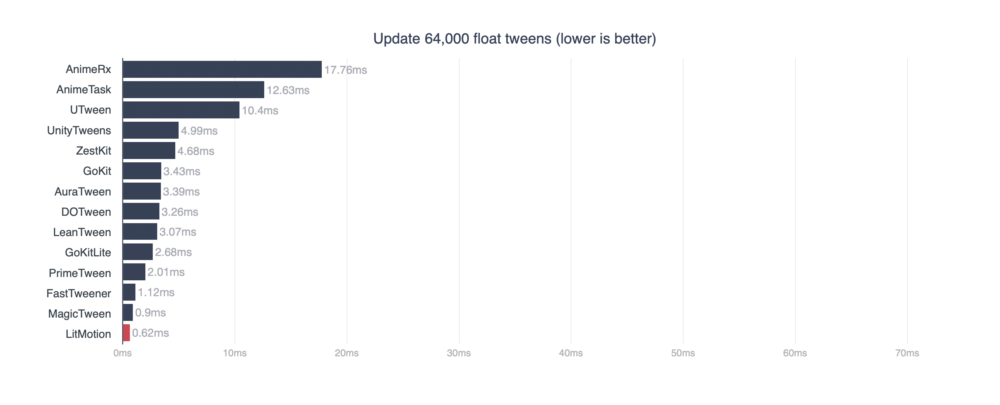

# LitMotion Overview

LitMotion is a high-performance tweening library for Unity. It encompasses a rich set of features to animate components like Transform, along with custom fields and properties, allowing for easy creation of animations.

Following my creation of [Magic Tween](https://github.com/AnnulusGames/MagicTween), LitMotion stands as my second tweening library. Leveraging the experience gained from implementing Magic Tween, LitMotion has been designed prioritizing essential features while ensuring it operates at the highest speed possible. It outperforms other tweening libraries by a staggering 2 to 20 times in various situations such as tween creation and execution. Naturally, there are no allocations during tween creation.

LitMotion not only boasts high performance but also offers a rich set of features viable for practical use as a tweening library.

* Animate anything in one line of code.
* Achieves zero allocations with a struct-based design
* Extremely high-performance implementation optimized using DOTS (Data-Oriented Technology Stack)
* Works in both runtime and editor
* Supports complex settings like easing and looping
* Waits for completion using callbacks/coroutines
* Zero allocation text animation
* Special motions such as Punch, Shake, etc.
* Converts to Observable using UniRx
* Supports async/await using UniTask
* Type extensions using `IMotionOptions` and `IMotionAdapter`

### Performance

LitMotion operates faster than any Unity tweening library, including Magic Tween, in both motion creation and execution. Below are the results of benchmarks.

---

---

---

---

The project and source code used for the benchmarks can be reviewed in [this repository](https://github.com/AnnulusGames/TweenPerformance).

### Comparison with DOTween/Magic Tween

Among other Unity tweening libraries like DOTween and the previously mentioned Magic Tween, LitMotion possesses distinct features in comparison.

* Excellent Performance
  - LitMotion operates about 5 times faster than DOTween.
  - It is about 1.5 times faster than the faster Magic Tween.
  - Additionally, there are no allocations during motion creation.
* Curated Features
  - While LitMotion provides sufficient features, it offers fewer functionalities compared to Magic Tween or DOTween. This approach aligns with the library's concept of being "Simple" (although room for extension is available).
* Simple and Flexible API
  - With a natural feel using method chaining, LitMotion enables smooth writing from motion creation to binding.
  - Unlike Magic Tween or DOTween, LitMotion does not include extension methods for components. While I acknowledge the advantages of extension methods, they can sometimes lead to confusion in terms of readability. LitMotion prioritizes API simplicity and unifies the entry point into the `LMotion` class.