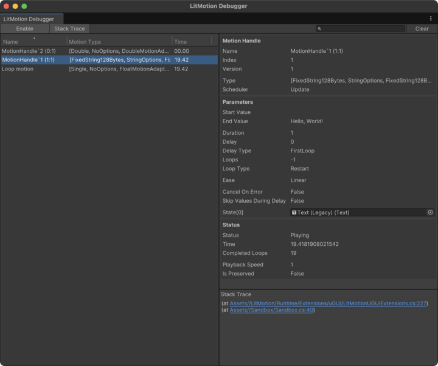

# LitMotion Debugger

LitMotion Debuggerウィンドウを使用することで、作成したモーションの情報を確認することができます。



`Window > LitMotion Debugger`からウィンドウを開き、\[Enable\]を押してデバッガを有効化します。また、\[Stack Trace\]を押して有効化することで、モーション作成時のスタックトレースを取得できます。

> [!WARNING]
> デバッガを有効化している間はパフォーマンスが大きく低下します。そのため基本的には無効にしておき、デバッグ時にのみ有効化することを推奨します。

## Debug Name

デバッガでは、対象のモーションを名前から検索することができます。デフォルトのデバッグ名は以下のようになります。

```cs
$"MotionHandle`{StorageId}({Index}:{Version})"
```

このデバッグ名はモーションの作成時に`WithDebugName()`を渡すことで変更できます。

```cs
var handle = LMotion.Create(0f, 1f, 1f)
    .WithDebugName("name")
    .Bind(x => { });
```

また、`GetDebugName()`からデバッグ名を取得できます。

```cs
var name = handle.GetDebugName();
```

このデバッグ名はDebugビルドのみ保持され、Releaseビルドでは削除されます。Releaseビルドでこの機能を利用する場合はScripting Define Symbolsに`LITMOTION_DEBUG`を追加してください。